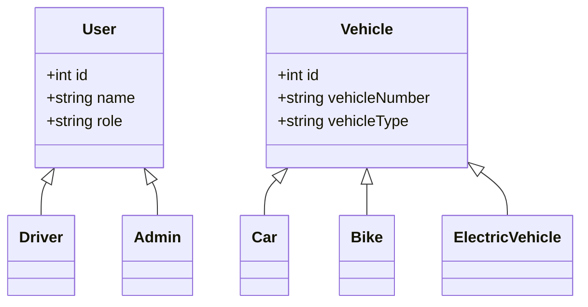

# Class Diagram – Smart Parking Management System

```mermaid
classDiagram

    class User {
        +int id
        +string name
        +string role
    }

    class Driver
    class Admin

    User <|-- Driver
    User <|-- Admin

    class Vehicle {
        +int id
        +string vehicleNumber
        +string vehicleType
    }

    class Car
    class Bike
    class ElectricVehicle

    Vehicle <|-- Car
    Vehicle <|-- Bike
    Vehicle <|-- ElectricVehicle
```
